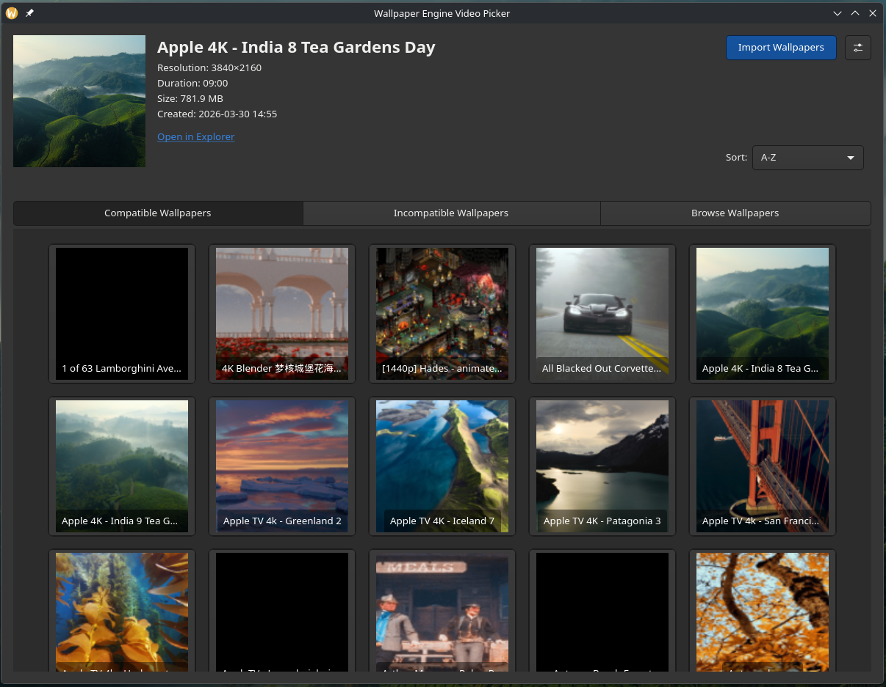
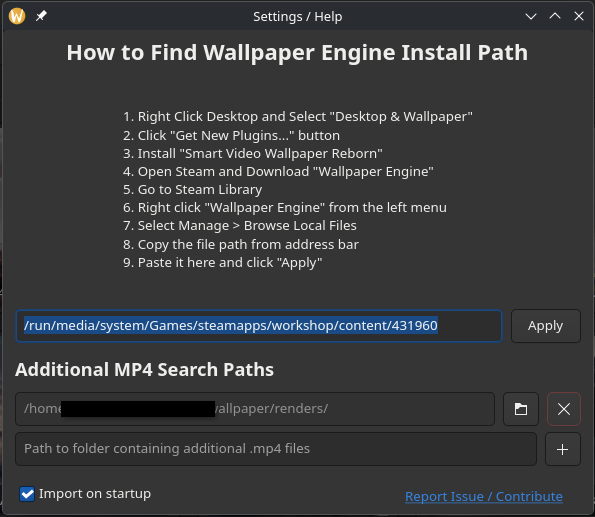

# WE Video Picker
### Software to connect wallpaper engine and KDE plugin "Smart Video Wallpaper Reborn"

## Screenshots
### Main Page

### Settings


## Quickstart
Run the following in a terminal

- to make the python file executable:
```
chmod +x we-video-picker.py
```

- the run the app: 
```
./we-video-picker.py
```

TODO:
- Fix bug where on startup, if you click "open in explorer", it takes you one folder above the target folder.
- add feature where if user has different plugin selected for wallpaper in KDE, then it will set it to the correct one and load
- check for wallpaper engine installed on startup so they know why images aren't loading
- error boxes instead of text. and make it red
    - error box for "WE not installed"
    - error box for "No Wallpapers Found"
    - error box for "KDE Plugin Not Installed"
